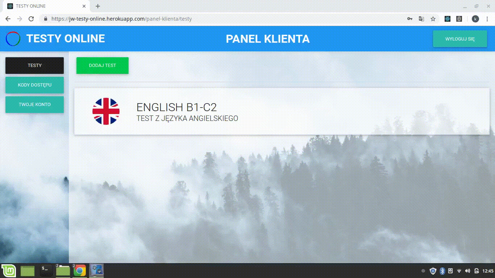
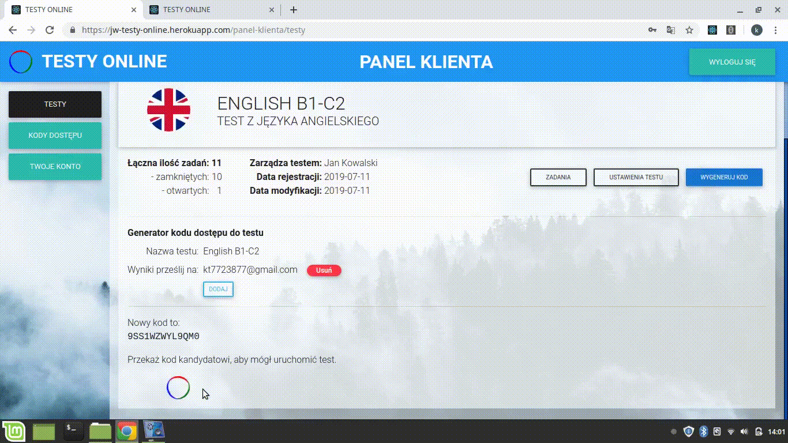

# --- JW-TESTY-ONLINE ---
Aplikacja dedykowana rekruterom.
 
Cel: automatyzacja testów kompetencji kandydatów.

### Demo:
Wersja demonstracyjna: [//jw-testy-online.herokuapp.com/](https://jw-testy-online.herokuapp.com)
 

### Zalety aplikacji:
- wyniki testu dostępne w ciągu chwili od jego zakończeniu przez kandydata,
- generowanie pliku PDF z wynikami tak, jakby kandydat wypełnił test papierowy,
- działa na różnych przeglądarkach, w tym na IE,
- przyjemny interfejs, stosowanie efektów na elementy interaktywne,
- możliwość udostępniania własnego testu innym osobom,
- zapis szczegółów testu dla każdego kodu, zmiana nie wypływa na te już wygenerowane,
- wystarczy przesłać kod oraz adres aplikacji i czekać na wyniki.
 

## UŻYTE TECHNOLOGIE

#### **_Ponadto_**

Frontend:
- wymuszenie stosowania protokołu https (przekierowanie http -> https),
- wykorzystanie standardu JWT do autoryzacji użytkownika,
- wykorzystanie klas i react-komponentów biblioteki _Material Design for Bootstrap 4_,
- joi-browser - walidacja wprowadzanych danych,
- przyspieszenie renderowania strony przez użycie bibliotek react-window i react-virtualized-auto-sizer,
- użycie Gulp.js do kompilowania stylów CSS z .scss,
- stosowanie plików .env dla środowisk development i production (inne bazy danych, inne adresy API node),
- zastosowanie react-confirm-alert z własnymi stylami okienek,
- dodatkowe biblioteki pomocnicze: babel-polyfill, axios, react-notifications, file-saver, jwt-decode, font-awesome.
 

Backend:
- autorska aplikacja napisana w Node.js / express,
- zastosowanie funkcji typu middleware,
- ukrywanie haseł użytkowników z użyciem biblioteki bcrypt,
- bezpieczna i szybka autoryzacja użytkowników z wykorzystaniem JSON Web Token,
- przechowywanie wrażliwych danych w zmiennych środowiskowych na serwerze, np. adres bazy danych,* \"salt"*,
- @hapi/joi - walidacja otrzymanych danych od użytkowników,
- baza danych - mongoDB, mongoose, modele i obsługa zapytań,
- generowanie pliku PDF z danych obiektu JSON - własny szablon .hbr + biblioteka puppeteer,
- obsługa operacji CRUD przez interfejsy API wg zasobów, np. api/tests, api/users,
- biblioteki pomocnicze: fs-extra, handlebars, nodemailer, helmet, compression, font-awesome, cors, puppeteer, mdbreact,
- podział struktury kodu, tzn. osobno routes, models, middlewares, startup files,
- demo kodu dostępne na osobnym repozytorium.
 

## OPIS I PREZENTACJA
### **_1. Rejestracja._**
Aby się zarejestrować należy podać imię i nazwisko lub nazwę, adres email i hasło dla tworzonego konta. Następnie aplikacja generuje i wysyła wiadomość na podany adres email z linkiem, którego uruchomienie powoduje zatwierdzenie konta.

### **_2. Tworzenie i modyfikacja testu._**
Aplikacja umożliwia łatwe tworzenie i modyfikowanie testów.
Layout: 
- góra: nagłówek,
- lewa strona: menu nawigacyjne po panelu klienta,
- prawa strona: część robocza, wyświetlanie danych.

#### **Dodawanie nowego testu.**
Kliknięcie w zakładkę "TESTY" spowoduje wyświetlenie widoku prezentującego dostępne testy wraz z przyciskiem dodawania.

#### **Zadania.**
Aby dodać, modyfikować lub usunąć zadania należy kliknąć dany test, a następnie przycisk "ZADANIA". Tryb edycji umożliwia usunięcie niezapisanych zmian.

### **_3. Generowanie kodu dostępu do testu._**
Kod dostępu do testu umożliwia uruchomienie sprawdzianu przez kandydata. Generator jest dostępny tylko jeżeli test zawiera przynajmniej jedno zadanie. Przycisk kreowania kodu powoduje utworzenie obiektu, w którym zapisywany jest obecny stan zadań i innych danych testu, jak np. limit czasowy. Wszelkie modyfikacje testu nie mają wpływu na wcześniej wytworzone kody. Serwer posiada funkcję tworzenia unikatowego 13-znakowego kodu, który jest zwracany do klienta i dołączany do ww. obiektu.

### **_4. Uruchamianie testu._**
Kandydat może uruchomić test tylko przez kod dostępu do testu. Miejsce gdzie, należy go umieścić znajduje się w widocznym miejscu na stronie startowej aplikacji. Wciśnięcie przycisku "ROZPOCZNIJ" spowoduje odcięcie białych znaków przed i za tekstem reprezentującym kod oraz wysłanie kodu na serwer.
 
Próba zostanie odrzucona, gdy:
- kod nie znajduje sie w bazie danych,
- lub został już wykorzystany.
 

#### **Wypełnianie testu.**
Przed rozpoczęciem testu wyświetlana jest instrukcja. W tym kroku kandydat jest zobowiązany do podania imienia i nazwiska. Po spełnieniu tego warunku możliwe jest przystąpienie do wypełniania testu poprzez wciśnięcie przycisku "START".
W górnej części znajduje się nagłówek wraz z zegarem pokazującym pozostały czas, sumą udzielonych odpowiedzi oraz z przyciskiem wysłania odpowiedzi. Zadania zamknięte posiadają możliwość zaznaczenia tylko jednej pozycji, a zadania otwarte mają blokadę wklejania treści. 

### **_5. Wyniki._**
Po wciśnięciu przycisku 'WYŚLIJ WYNIKI" lub upływie dozwolonego czasu wyniki są wysyłane na serwer. Na podstawie tych informacji jest tworzony plik PDF i wysyłany na adres mailowy rekrutera. Możliwe jest również wygenerowanie pliku .pdf w dowolnej chwili w zakładce "KODY DOSTĘPU".

## UWAGI
Jest to demonstracyjne repozytorium, tzn. posiada tylko część kodu.

#### **Ciekawostka.**
Projekt napisany z zastosowaniem polskiego nazewnictwa dla komponentów, funkcji czy zmiennych
w celu sprawdzenia jakie są wady i zalety takiego stylu.

